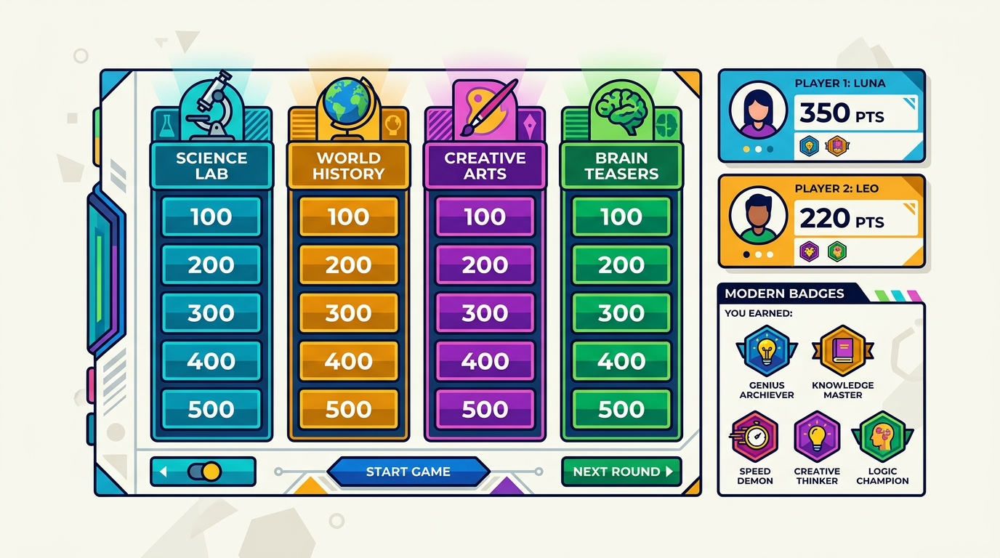

# 🧠 KI-Quiz

Ein interaktives, gamifiziertes Quiz im Jeopardy-Stil für Weiterbildungen, Workshops und den Unterricht – konzipiert für das **CAS PICTS Aufbaumodul Künstliche Intelligenz** (Pädagogischer ICT-Support) und adaptable für jede Lerngruppe.



---

## ✨ Highlights & Funktionen

- **🎮 Jeopardy-Spielmatrix (3 × 4)**:
  - 3 Kategorien mit jeweils 4 ansteigenden Schwierigkeitsstufen (100, 200, 300, 400 Punkte).
  - Vorkonfiguriertes, praxiserprobtes Fragen-Set zu KI-Themen (Prompting & LLMs, Didaktik im Unterricht, Ethik & Schweizer Recht).
- **👥 2 Gruppen / Teams**:
  - Frei anpassbare Gruppennamen, Farben und Wappen (Roboter, Gehirn, Rakete, Chip etc.).
  - Integrierter digitaler **Münzwurf** zur fairen Bestimmung der Startgruppe.
  - Automatischer Rundenwechsel nach jeder beantworteten Frage mit aktiver Zugs-Anzeige.
- **🖥️ Beamer- & Fullscreen-optimiert (100vh)**:
  - Exakt bildschirmfüllend ohne vertikales Scrollen im Spielmodus – ideal für Projektion im Kursraum oder am interaktiven Whiteboard.
  - Helles, kontrastreiches und modernes UI.
- **✨ Integrierter KI-Prompt-Generator**:
  - Generiert massgeschneiderte System-Prompts für ChatGPT, Claude oder Google Gemini.
  - 1-Klick-JSON-Import: Fragensets per Copy & Paste direkt aus der KI ins Quiz importieren.
- **🔄 Immer wiederherstellbar**:
  - Button «Ursprungsfragen laden» ist an allen Stellen (Header, Editor, Spielfeld, Siegerehrung) mit einem Klick erreichbar.
  - JSON-Export zur Sicherung eigener Fragensammlungen.
- **💾 100% Offline & Lokal**:
  - Alle Spielstände, Teams und Fragen werden automatisch im `localStorage` des Browsers gesichert (bleibt bei Refresh erhalten).
  - Audio-Effekte (Erfolg, Buzzer, Fanfare) werden über die **Web Audio API** synthetisiert (keine externen MP3-Dateien oder Netzwerkanfragen nötig).
- **🇨🇭 Schweizer Rechtschreibung**:
  - Durchgängig Schweizer Rechtschreibung («ss» statt «ß»).

---

## 🚀 Schnellstart

### Voraussetzungen
- Node.js (Version 18 oder höher empfohlen)
- npm oder pnpm

### Installation

```bash
# 1. Repository klonen
git clone https://github.com/DEIN-BENUTZERNAME/ki-quiz.git
cd ki-quiz

# 2. Abhängigkeiten installieren
npm install

# 3. Lokalen Entwicklungsserver starten
npm run dev
```

Die Anwendung ist standardmässig unter `http://localhost:3000` erreichbar.

### Produktions-Build erstellen

```bash
# Erstellt ein optimiertes Bundle im /dist Ordner
npm run build

# Vorschau des Builds lokal testen
npm run preview
```

---

## 📖 Spielablauf & Phasen

```
[ 1. Fragen & Prompt ] ──► [ 2. Gruppen einrichten ] ──► [ 3. Quizboard spielen ] ──► [ Siegerehrung ]
```

1. **Fragen verwalten**:
   - Die 3 Kategorien benennen und Fragen/Optionen nach Bedarf anpassen.
   - Alternativ über den Button **«KI-Prompt-Generator»** in Sekunden neue Fragen per KI generieren lassen.
2. **Gruppen einrichten**:
   - Namen der beiden Gruppen eingeben, Wappen und Farben wählen.
   - Startgruppe per Hand oder per **Münzwurf** festlegen.
3. **Spielen**:
   - Die aktive Gruppe wählt eine offene Frage auf dem Board.
   - Gruppe berät sich (optional mit 60-Sekunden-Timer) und wählt eine Antwort.
   - **Antwort auflösen**: Zeigt sofort die didaktische Erklärung, spielt Sound ab und bucht die Punkte automatisch auf das Gruppenkonto.
4. **Siegerehrung**:
   - Nach allen 12 Fragen (oder vorzeitigem Auswerten) wird das Siegerteam mit Konfetti und Podest-Statistik gefeiert.

---

## 🛠️ Verwendete Technologien

- **Frontend-Framework**: [React 19](https://react.dev/) mit [TypeScript](https://www.typescriptlang.org/)
- **Build-Tool**: [Vite](https://vitejs.dev/)
- **Styling**: [Tailwind CSS v4](https://tailwindcss.com/)
- **Icons**: [Lucide React](https://lucide.dev/)
- **Sound**: Native Browser [Web Audio API](https://developer.mozilla.org/en-US/docs/Web/API/Web_Audio_API) (synthetisiert, null Asset-Abhängigkeiten)
- **Animationen**: HTML5 Canvas Konfetti & CSS Transitions

---

## 📂 Projektstruktur

```
├── index.html                   # HTML-Einstiegspunkt mit Schriftarten & Meta-Tags
├── package.json                 # Projektabhängigkeiten und Skripte
├── metadata.json                # App-Metadaten
├── vite.config.ts               # Vite Konfiguration
├── src/
│   ├── main.tsx                 # React Root-Einstiegspunkt
│   ├── App.tsx                  # Haupt-State-Machine, LocalStorage & Routing
│   ├── index.css                # Tailwind CSS Import & Base-Styles
│   ├── types.ts                 # TypeScript Interfaces (Question, Category, Team, etc.)
│   ├── data/
│   │   └── defaultQuestions.ts  # 12 kuratierte CAS PICTS Originalfragen
│   ├── utils/
│   │   ├── audio.ts             # Web Audio API Soundeffekte (Erfolg, Buzzer, Fanfare)
│   │   └── confetti.ts          # Canvas-Partikelanimation für Siegerehrung
│   └── components/
│       ├── Header.tsx           # Navigation, Ton-Mute, Vollbild & Schnelltasten
│       ├── GameBoard.tsx        # 100vh bildschirmfüllendes 3x4 Jeopardy-Board
│       ├── QuestionModal.tsx    # Fragedarstellung, Timer, Auswahl & Erklärung
│       ├── QuestionsEditor.tsx  # Fragenverwaltung & JSON-Export
│       ├── PromptGeneratorModal.tsx # KI-Prompt-Generator & JSON-Import
│       ├── TeamSetup.tsx        # 2-Team-Konfiguration & Münzwurf
│       └── WinnerCelebration.tsx# Podest, Konfetti & Revanche-Funktion
```

---

## 📜 Lizenz & Weiterverwendung

Dieses Projekt ist für Bildungszwecke (insbesondere im Rahmen von Weiterbildungen wie dem **CAS PICTS**) frei nutzbar und anpassbar.

Viel Spass beim Quizzen im Kursraum! 🎉
